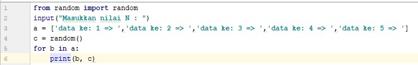
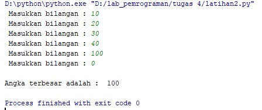
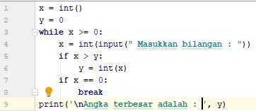
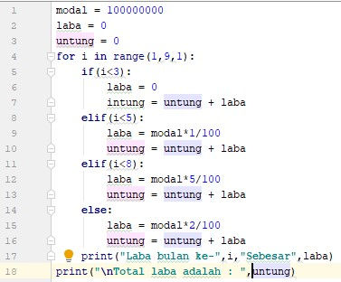

# Penjelasan program Latihan 1 <h2> 
__program untuk menampilkan nilai random yang kurang dari 0,5 sebanyak N kali dengan perulangan__

**__algoritma__**

* Mulai
* Baca N (untuk menentukan berapa bayak perulangan yang akan dilakuakan)
* Perulangan x (sebanyak hasil inputan N )
* inisialisasi a = random.uniform(0,5) (untuk menghasilkan random yang kurang dari 0,5) 
* di import dari random
* tampilkan a(nilai random) sebanyak N kali
* selesaii

**__program__**

# 
**__hasil eksekusi program latihan 1__**

# 

# penjelasan program Latihan 2 <h2>

__program menentukan niali terbesar dari hasil inputan saat runtime 
inputan akan berhenti jika memasukan bilangan 0 (Nol)__

**__algoritma__**

* mulai
* inisialisai list1 (untuk menampung data input)
* baca a (membaca inputan yang dimasukan )
* tambahkan inputan ke dalam list (penggunaan append)
* perulangan jika a != 0 maka baca a dan tambahkan ke list1
* tampilkan Nilai tertinggi dari dari list1
* selesai

**__program__**

# 

**__hasil eksekusi program latihan 2__**

# 

# penjelasan program 1 <h2>

__Seorang pengusaha menginvestasikan uangnya untuk memulai usahanya dengan modal awal 100 juta, pada bulan pertama dan kedua belum mendapatkan laba, pada bulan ketiga baru mulai 
mendapatkan laba sebesar 1% dan pada bulan kelima, pendapatan meningkat 5%, selanjutnya pada bulan ke8 mengalami penurunan keuntungan sebesar 2%, sehingga laba menjadi 3%.__

program

# 

hasil eksekusi program 1

# 
